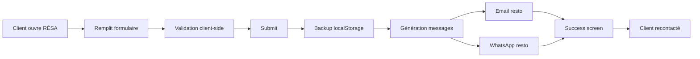

# 📅 DIGIY RÉSA — Réservation Restaurant 0% Commission

[](https://opensource.org/licenses/MIT)
[](https://beauville.github.io/digiy-resa/)
[](https://beauville.github.io/digiy-hub/)

**Interface client premium pour réserver une table au restaurant sans intermédiaire.**  
Confirmation automatique par WhatsApp & Email. Zéro commission. Direct restaurateur ↔ client.

---

## 🎯 Fonctionnalités

✅ **Réservation intuitive** — Formulaire simple et rapide  
✅ **Calendrier intelligent** — Date minimale auto, créneaux Midi/Soir  
✅ **Gestion des zones** — Sélection Salle A, Terrasse, etc.  
✅ **Confirmation double** — WhatsApp + Email automatiques  
✅ **Multi-restaurant** — Configuration via URL params  
✅ **Design premium** — Animations fluides, interface moderne  
✅ **Responsive** — Mobile, tablette, desktop  
✅ **PWA Ready** — Installable comme une app native  
✅ **Backup local** — localStorage en cas de perte de connexion  

---

## 🚀 Démo en ligne

**URL de base :**  
[https://beauville.github.io/digiy-resa/](https://beauville.github.io/digiy-resa/)

**Exemple Le Malraux :**  
[https://beauville.github.io/digiy-resa/?resto=le-malraux&name=Le%20Malraux](https://beauville.github.io/digiy-resa/?resto=le-malraux&name=Le%20Malraux)

**Exemple Chez Baptiste :**  
[https://beauville.github.io/digiy-resa/?resto=chez-baptiste&name=Chez%20Baptiste&wa=221771234567&email=contact@restaurant.sn](https://beauville.github.io/digiy-resa/?resto=chez-baptiste&name=Chez%20Baptiste&wa=221771234567&email=contact@restaurant.sn)

---

## 📦 Installation

### **Option 1 : GitHub Pages (Recommandé)**

```bash
# 1. Fork ce repo ou crée un nouveau dépôt
# 2. Upload digiy-resa-stable.html et renomme en index.html
# 3. Settings → Pages → Deploy from main branch
# 4. URL sera : https://TON-USERNAME.github.io/TON-REPO/
```

### **Option 2 : Local**

```bash
# Clone le repo
git clone https://github.com/TON-USERNAME/digiy-resa.git

# Ouvre dans le navigateur
open index.html
```

### **Option 3 : Netlify Drop**

```bash
# 1. Va sur app.netlify.com/drop
# 2. Drag & drop le fichier HTML
# 3. URL live instantanée
```

---

## ⚙️ Configuration

### **Personnalisation par URL (Multi-restaurant)**

L'app supporte plusieurs restaurants via des paramètres URL :

```
?resto=identifiant-unique
?name=Nom%20Complet%20Restaurant
?wa=33612345678
?email=contact@restaurant.com
```

**Exemple complet :**
```
https://TON-URL/?resto=chez-marie&name=Chez%20Marie&wa=221771234567&email=marie@resto.sn
```

### **Valeurs par défaut**

Si aucun paramètre fourni :
- `resto` = `le-malraux`
- `name` = `Le Malraux`
- `wa` = `33638329423`
- `email` = `digiylyfe@gmail.com`

### **Modifier les zones disponibles**

Dans le code HTML, section `<select id="res-zone">` :

```html
<optgroup label="✅ Réservable">
    <option value="Salle A" data-capacity="30">Salle A RDC (30 places)</option>
    <option value="Terrasse" data-capacity="40">Terrasse (40 places)</option>
    <!-- Ajoute tes zones ici -->
</optgroup>
```

### **Modifier les créneaux horaires**

Dans le code HTML, section `<select name="heure">` :

```html
<optgroup label="🌞 Midi">
    <option value="12:00">12:00</option>
    <option value="12:30">12:30</option>
    <!-- Ajoute tes horaires -->
</optgroup>
```

---

## 🔗 Intégration DIGIY HUB

Pour intégrer DIGIY RÉSA dans le DIGIY HUB :

**1. Ajoute le lien dans `LINKS` :**

```javascript
const LINKS = {
  // ... autres modules
  resa: "https://TON-URL/digiy-resa/"
};
```

**2. Ajoute la carte module :**

```html
<div class="module">
  <div class="module-header">
    <div class="module-icon">📅</div>
    <div class="module-titles">
      <div class="module-name">DIGIY RÉSA</div>
      <div class="module-tagline">Réservation de tables</div>
    </div>
    <div class="module-badge">🔥 Connecté</div>
  </div>
  <div class="module-body">
    Interface client pour réserver une table au restaurant. Confirmation WhatsApp & email.
  </div>
  <div class="module-foot">
    <button class="module-btn" onclick="openModule('resa')">
      Ouvrir RÉSA →
    </button>
    <div class="module-mini">Clients restaurants</div>
  </div>
</div>
```

---

## 🎨 Personnalisation Design

### **Couleurs principales**

Variables CSS à modifier dans `<style>` :

```css
:root{
    --digiy-gold:#D4AF37;           /* Or principal */
    --digiy-gold-light:#E8C965;     /* Or clair */
    --digiy-green:#16a34a;          /* Vert succès */
    --digiy-red:#dc2626;            /* Rouge erreur */
    --digiy-dark:#0f0f0f;           /* Fond sombre */
    --digiy-grey:#1a1a1a;           /* Gris foncé */
    --digiy-text-light:#E0E0E0;     /* Texte clair */
}
```

### **Logo/Icône**

Modifier la div `.logo` dans le HTML :

```html
<div class="logo">🍽️</div>  <!-- Change l'emoji -->
```

---

## 📱 PWA (Progressive Web App)

### **Prérequis**

Pour activer l'installation PWA, crée 2 fichiers :

**1. `manifest-resa.json`**

```json
{
  "name": "DIGIY RÉSA",
  "short_name": "RÉSA",
  "description": "Réservation restaurant 0% commission",
  "start_url": "/",
  "display": "standalone",
  "background_color": "#0f0f0f",
  "theme_color": "#D4AF37",
  "icons": [
    {
      "src": "icon-192.png",
      "sizes": "192x192",
      "type": "image/png"
    },
    {
      "src": "icon-512.png",
      "sizes": "512x512",
      "type": "image/png"
    }
  ]
}
```

**2. Icônes PNG**

- `icon-192.png` (192x192px)
- `icon-512.png` (512x512px)

Générateur en ligne : [favicon.io](https://favicon.io/)

---

## 🔧 Développement

### **Structure du code**

```
digiy-resa-stable.html
├── <style>           CSS complet intégré
├── <body>            Structure HTML
│   ├── Badge statut
│   ├── Container principal
│   │   ├── Header (logo, titre)
│   │   ├── Formulaire
│   │   │   ├── Date, Heure, Personnes
│   │   │   ├── Zone (avec validation)
│   │   │   ├── Nom, WhatsApp, Email
│   │   │   └── Bouton submit
│   │   └── Footer
│   └── Success screen (dynamique)
└── <script>          Logique JavaScript
    ├── Config (URL params)
    ├── Form validation
    ├── Zone status logic
    ├── Submit handler
    │   ├── localStorage backup
    │   ├── Email generation
    │   ├── WhatsApp notification
    │   └── Success animation
    └── Event listeners
```

### **Technologies**

- **HTML5** — Structure sémantique
- **CSS3** — Variables, Grid, Flexbox, Animations
- **JavaScript (ES6+)** — Vanilla, pas de dépendances
- **localStorage API** — Backup local
- **FormData API** — Gestion formulaire
- **URLSearchParams API** — Configuration dynamique
- **mailto:** — Email automatique
- **WhatsApp API** — Notification instantanée

---

## 📊 Flux de Réservation



---

## 🔐 Sécurité

### **Validation**

- ✅ Validation HTML5 (`required`, `type`, `min`, `max`)
- ✅ Validation JavaScript côté client
- ✅ Pattern téléphone personnalisable
- ✅ Date minimale = aujourd'hui (automatique)
- ✅ Zones non-réservables bloquées

### **Privacy**

- ✅ Pas de tracking tiers
- ✅ Données stockées localement uniquement
- ✅ Email/WhatsApp directs (pas de serveur intermédiaire)
- ✅ Pas de cookies

### **Limitations**

⚠️ **Pas de backend** : Les réservations sont envoyées par email/WhatsApp uniquement.  
⚠️ **Pas d'authentification** : Interface publique ouverte.  
⚠️ **Pas de base de données** : Utilise localStorage comme backup temporaire.

Pour une solution complète avec backend, voir [DIGIY RESTO PRO](https://github.com/beauville/digiy-resto) qui inclut Firebase.

---

## 🤝 Intégration avec DIGIY RESTO PRO

**DIGIY RÉSA** (interface client) + **DIGIY RESTO PRO** (gestion restaurant) = Solution complète !

| Feature | DIGIY RÉSA | DIGIY RESTO PRO |
|---------|-----------|----------------|
| **Audience** | Clients | Personnel restaurant |
| **Fonction** | Réserver table | Gérer salle/commandes |
| **Backend** | localStorage | Firebase Realtime |
| **Sync** | Email/WhatsApp | Temps réel multi-appareils |
| **Installation** | Simple HTML | PWA + Firebase config |

**Recommandation :** Utilise les deux ensemble pour un écosystème complet !

---

## 📈 Roadmap

### **V1.0 (Actuel)**
- ✅ Réservation basique
- ✅ Email + WhatsApp
- ✅ Multi-restaurant
- ✅ Design premium
- ✅ Responsive

### **V1.1 (Prévu)**
- 🔄 Firebase integration (sync avec RESTO PRO)
- 🔄 Confirmation par SMS
- 🔄 Calendrier disponibilité temps réel
- 🔄 Historique réservations client

### **V2.0 (Futur)**
- 🚧 DIGIY PAY integration (paiement acompte)
- 🚧 Programme fidélité
- 🚧 Reviews & ratings
- 🚧 Multilingue (FR/EN/WO)

---

## 🐛 Troubleshooting

### **Le formulaire ne s'envoie pas**

1. Vérifie que tous les champs requis sont remplis
2. Ouvre la console (F12) pour voir les erreurs
3. Vérifie que ton navigateur autorise `mailto:` et `window.open()`

### **WhatsApp ne s'ouvre pas**

- Certains navigateurs bloquent les popups
- Solution : Autorise les popups pour ce site
- Alternative : Utilise uniquement l'email

### **Le design ne s'affiche pas**

- Vide le cache : Ctrl+Shift+R
- Vérifie que le CSS est bien dans le fichier
- Teste sur un autre navigateur

### **La date minimale ne fonctionne pas**

- Vérifie que JavaScript est activé
- Le navigateur doit supporter `<input type="date">`
- Fallback : utilise un sélecteur de date custom

---

## 📄 Licence

**MIT License**

Copyright (c) 2024 DIGIYLYFE

Permission is hereby granted, free of charge, to any person obtaining a copy of this software and associated documentation files (the "Software"), to deal in the Software without restriction, including without limitation the rights to use, copy, modify, merge, publish, distribute, sublicense, and/or sell copies of the Software, and to permit persons to whom the Software is furnished to do so, subject to the following conditions:

The above copyright notice and this permission notice shall be included in all copies or substantial portions of the Software.

THE SOFTWARE IS PROVIDED "AS IS", WITHOUT WARRANTY OF ANY KIND, EXPRESS OR IMPLIED.

---

## 👥 Contributing

Les contributions sont les bienvenues ! 🎉

### **Comment contribuer :**

1. Fork le projet
2. Crée une branche (`git checkout -b feature/AmazingFeature`)
3. Commit tes changements (`git commit -m 'Add some AmazingFeature'`)
4. Push sur la branche (`git push origin feature/AmazingFeature`)
5. Ouvre une Pull Request

### **Guidelines :**

- Code propre et commenté
- Respecte le style existant
- Teste sur mobile et desktop
- Update le README si nécessaire

---

## 📞 Support

**Besoin d'aide ?**

- 📧 Email : [digiylyfe@gmail.com](mailto:digiylyfe@gmail.com)
- 💬 WhatsApp : [+33 6 38 32 94 23](https://wa.me/33638329423)
- 🌐 DIGIY HUB : [https://beauville.github.io/digiy-hub/](https://beauville.github.io/digiy-hub/)

---

## 🔗 Ecosystem DIGIYLYFE

DIGIY RÉSA fait partie de l'écosystème DIGIYLYFE :

| Module | Description | URL |
|--------|-------------|-----|
| **DIGIY HUB** | Super app centralisée | [Hub](https://beauville.github.io/digiy-hub/) |
| **DIGIY DRIVER** | VTC 0% commission | [Driver](https://beauville.github.io/digiy-driver-client/) |
| **DIGIY LOC** | Hébergement direct | [Loc](https://beauville.github.io/chez-baptiste-digiy-loc/) |
| **DIGIY POS** | Caisse restaurant | [POS](https://beauville.github.io/Caisse-officielle-ASTOU/) |
| **DIGIY RESTO** | Gestion restaurant | [Resto](https://beauville.github.io/digiy-resto/) |
| **DIGIY RÉSA** | Réservation client | [Résa](https://beauville.github.io/digiy-resa/) |

---

## ⭐ Star ce projet !

Si DIGIY RÉSA t'a été utile, donne une ⭐ sur GitHub !  
Ça aide à faire connaître l'écosystème DIGIYLYFE. 🙏

---

## 🎯 Mission

**Construire des outils digitaux qui servent le peuple, pas les actionnaires.**

∞ DIGIYLYFE — Pas d'OTA, pas de racket. Juste le peuple & ses outils.

---

**Made with ❤️ in Senegal 🇸🇳 & France 🇫🇷**
